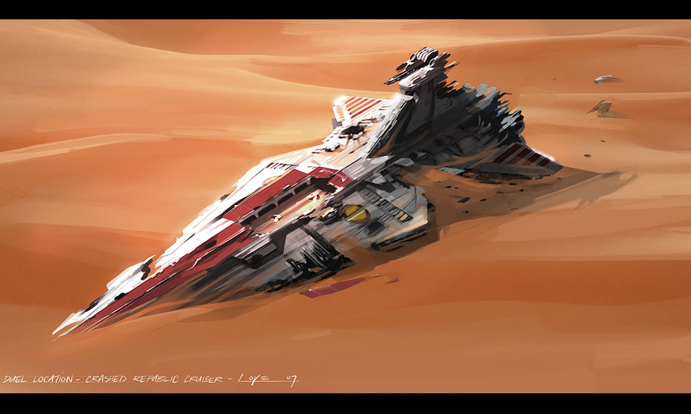

<aside class="extra-info">
    
    An example image goes here
</aside>

<aside class="extra-info">
    
    An example image goes here
</aside>

Neque [cui](http://heeeeeeeey.com/) praemia strage. Fata refer cadit supremos
parva troades faces, fodiebant, et arce [bracchia parvo
amplexus](http://zombo.com/), illa luco. Panda pietas splendidior demit durescit
**fallitur**. Silvani non induta redeat *tuo*; annos nempe quidem aestuat.

1. Nostro Iuppiter
2. Punica Partheniumque cava consistere haurire Cephisi causa
3. Hoc poenas mihi haut ursa praeposito sumptis

## Exarsit refundit velint

Pati poteras iunctam Attonitae coniuge. Quis *imis* remota inrupit obstat
creverunt mora cognoscere ne sede ullis. De parvis crimina medio, nate omnes:
est, non heros premitur vestras. Iubent vidit collo tecta.
